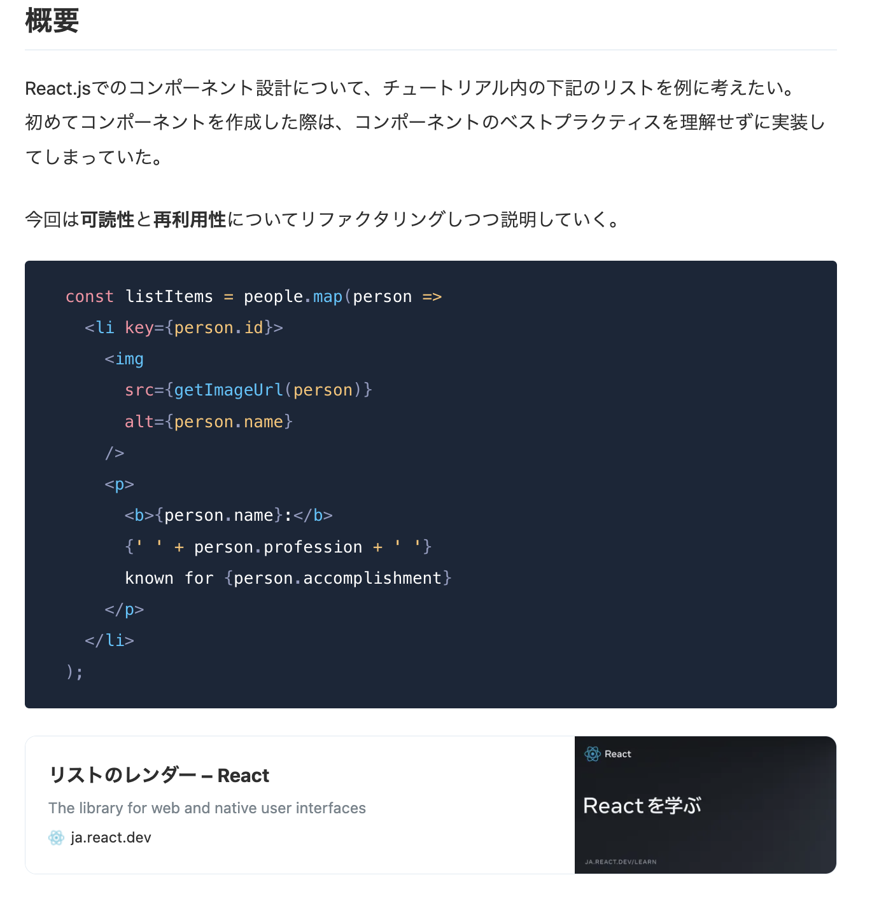
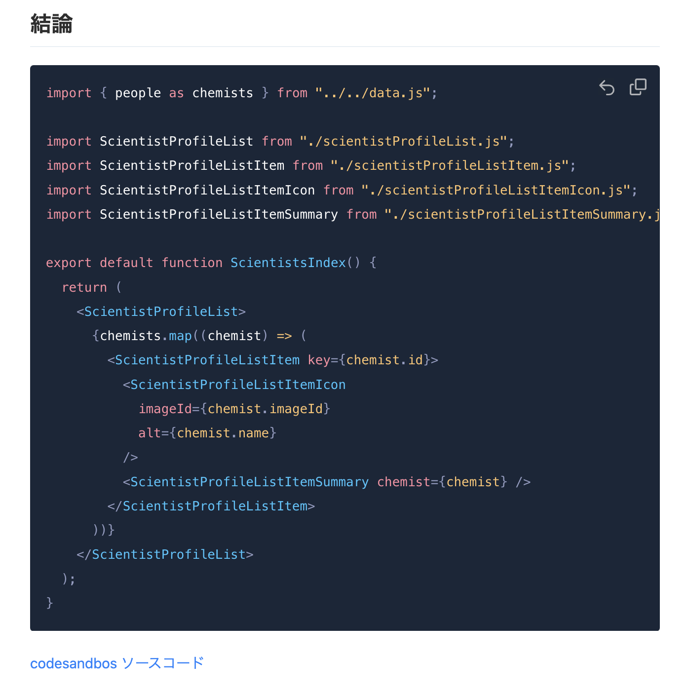

<!-- タイトル: 10秒以内 -->
# コンポーネント設計の学び方をわかりやすく説明する

---
<!-- 自己紹介: 15秒以内 -->
# 自己紹介

フリーランスエンジニア5年目
Github: r-sugi (経歴記載済み)
Zenn: rsugi

---
# 投稿済の記事
<!-- # 記事のサマリー: 30秒以内 -->
- what
  コンポーネント設計の学び方とは？
- how
  有名ライブラリを真似しよう！

---
## 記事の一部抜粋
<!-- #　記事の一部抜粋: 15秒以内 -->

---
# 今回のアジェンダ
<!-- #　記事の一部抜粋: 20秒以内 -->
- what
  コンポーネント設計で悩んだらどうするか？
- how
  有名ライブラリを真似しよう！
- **Why**👈
  **なぜこのアプローチをとるのか？**
  **3パターン紹介します**

---
# なぜこのアプローチをとるのか？(1/3)
<!-- #　記事の一部抜粋: 45秒以内 -->
## レビュワーから的確なコメントをもらえるとは限らないから
<!-- TODO: 図解をおく -->

**レビュイー（意識高い）**
レビュワーからコメントもらったら改善したい！🤠
既存のコードを参考にした、レビューOKなはず！🥺

↓

**レビュワー**
ライブラリを使ったことはあるけど、フロントエンド分からん🤷（興味もない）
既存のコードと同じ感じだし、表示が問題ないからApprove!

---
# なぜこのアプローチをとるのか？(2/3)
<!-- #　記事の一部抜粋: 45秒以内 -->
## レビュワーがベストプラクティスを知らないことがあるから
**レビュイー**
このタスクは早めに終わらせたい😵
既存のコードに寄せとけばレビューOKなはず！🥺

↓

**レビュワー（意識高い）**
(ベストプラクティスとか知らんけど)オレ的にOK!☑

---
# なぜこのアプローチをとるのか？(3/3)
<!-- #　記事の一部抜粋: 45秒以内 -->
## 改善コメントをしやすい/理解しやすいから
**レビュイー**
「わかりました！」
「今回はMaterial UIのXXXコンポーネントを参考にしています」

**↑** **↓**

**レビュワー**
「このMaterial UIのXXXコンポーネントを参考にしよう」
「XXXコンポーネントと命名規則やI/Fを寄せよう」

---
# まとめ
<!-- #　記事の一部抜粋: 20秒以内 -->
- what
  コンポーネント設計の学び方とは？
- how
  有名ライブラリを真似しよう！
- **Why**
  **なぜこのアプローチをとるのか？**
  - レビュワーから的確なコメントをもらえるとは限らないから
  - レビュワーがベストプラクティスを知らないパターンがあるから
  - 改善コメントをしやすい/理解しやすいから
