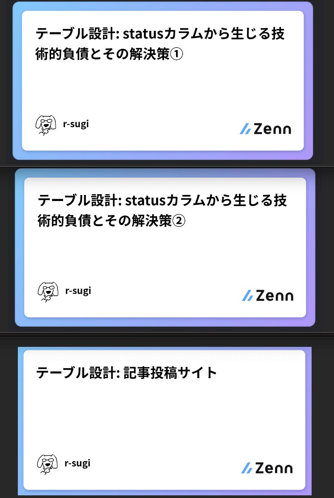
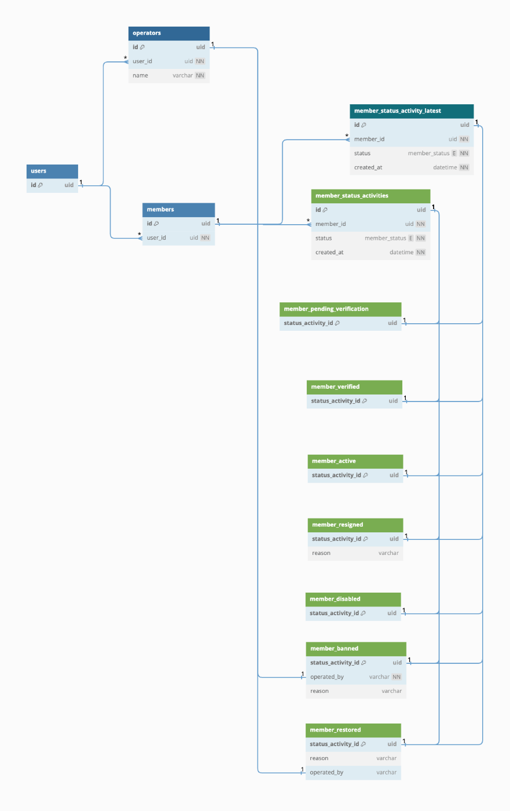
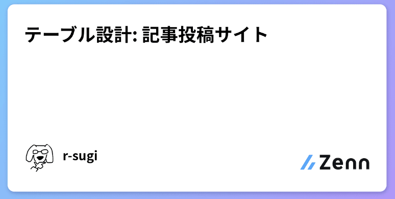

<!-- タイトル: 10秒以内 -->
<!-- 「statusカラムから生じる技術的負債とその解決策」について説明します。 -->
<!-- RDBのテーブル設計で -->
# statusカラムから生じる技術的負債とその解決策

---
<!-- 自己紹介: 15秒以内 -->
<!-- 先に自己紹介しますね。r-sugiと言います -->
<!-- エンジニア5年目でフロントエンド歴の方が多めです。-->
# 自己紹介

### フリーランスエンジニア5年目

---
# 今回のアジェンダ
<!-- #　記事の一部抜粋: 20秒以内 -->
- statusカラムがあるとなぜ困るか
- 解決案を1つ提示するので、みんなであれこれ議論したい

---
# statusカラムがあるとなぜ困るか(1/3)
<!-- #　記事の一部抜粋: 45秒以内 -->
<!-- で、そもそも何で困るんだっけ？ -->
- statusカラム
  → 特定のstatusに依存するカラムが増える(nullカラム)
  → カラム多すぎテーブルが生まれる
- statusカラム → 更新したら履歴が消える

<!-- TODO: イメージ図 クソuserテーブルの図を追加する -->
<!-- id
status
first_name
last_name
nickname
phone_number
birthday
email
delete_flag
admin_flag
created_at
updated_at -->

---
# statusカラムがあるとなぜ困るか(2/3)
<!-- #　記事の一部抜粋: 45秒以内 -->
<!-- 放っておくと、開発するのがキツくなる -->
## データベースの歪み → アプリケーションの歪み
- statusカラム → スパゲティ🍝
- statusカラム x activerecordパターン → 特盛スパゲティ🍝🍝🍝

**→アプリケーション側に、ステータスを考慮した(Null)カラム操作、処理が増え続ける**
**→テーブルは簡単に修正できない**

---
# statusカラムがあるとなぜ困るか(3/3)
## statusカラム x activerecordパターン
→ 特盛スパゲティ🍝🍝🍝 の気配

<!-- TODO: 再掲イメージ図 クソuserテーブルの図を追加する -->

---
<!-- # 記事のサマリー: 30秒以内 -->
<!-- 前提として、記事を投稿済です。 -->
<!-- いいね、コメントでアドバイスいただけると助かります。 -->
<!-- こういう場合はどうなの？こうやったらどうかな？というポジティブなコメントだと嬉しいです。 -->
# 投稿済の記事

---
## 改善過程(1/n)
### 改善対象のuserテーブル
<!-- TODO: クソuserテーブルの図を追加する -->

---
## 改善過程(2/n)
### 意味のある単位に分割する
<!-- TODO: 良きuserテーブル1 サブタイプ分離、カラム分離の図を追加する -->

---
## 改善過程(3/n)
### 関連をつける
<!-- TODO: 良きuserテーブル2 has_oneの図を追加する -->

---
## 改善過程(4/n)
### statusでまとめる
<!-- TODO: 良きuserテーブル3 の図を追加する -->

---
## 改善過程(5/n)
### status変更に関係のある値を保存したい
status変更理由、変更操作者などの情報はカラム追加(or 子テーブル追加)
- 例: 退会フォームの入力値、管理者による強制退会の退会理由
- 例: アカウント作成過程で使うワンタイムな値
<!-- TODO: 良きuserテーブル4 の図を追加する -->

---
## 改善過程(6/n)
### enumのカラムだけじゃなく、状態テーブルが存在する方が理解しやすいかも。
- 図解したときにライフサイクルがパッとわかる
<!-- TODO: 良きuserテーブル5 の図を追加する -->

---
## 改善過程(7/n)
### ログインユーザーを判定したい
- 最新のstatusだけを取得する
<!-- statusは一旦良さそう。残りのカラムを整理しよう -->
<!-- TODO: 良きuserテーブル6 の図を追加する -->

---
## 改善過程(8/n)
### status以外の項目を保存したい
- マイページから入力するアカウント項目を保存したい
<!-- TODO: 良きuserテーブル7 の図を追加する -->

---
<!-- #　記事の一部抜粋: 30秒以内 -->
## 記事のまとめ
### ロングタームイベントパターン
- ステータスの観点で分離する
- Read/Writeで分ける

---
<!-- #　記事の一部抜粋: 45秒以内 -->
## 記事の一部抜粋
### 例: 記事投稿サイトで試しています
- 発生しそうなユースケースに対応できるか検証中
- いいね、アドバイスいただけると嬉しいです！

---
<!-- #　記事の一部抜粋: 10秒以内 -->
# まとめ
## ✅statusカラムと正しく向き合う！
