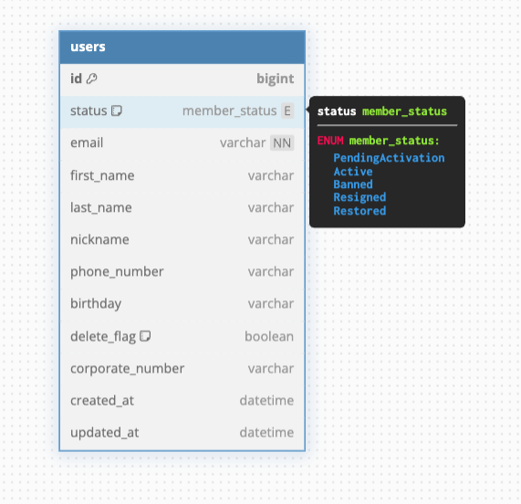
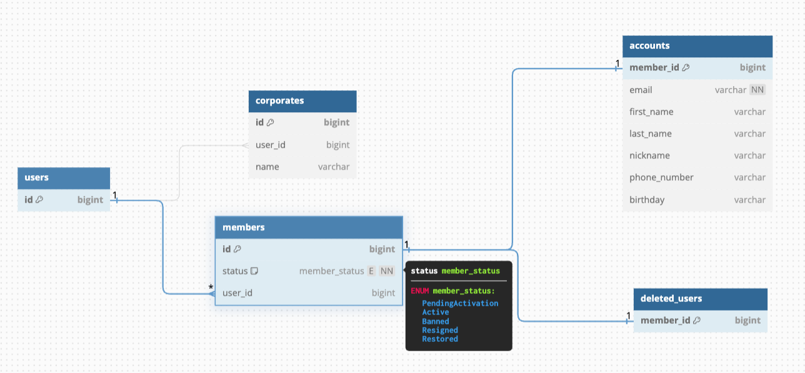
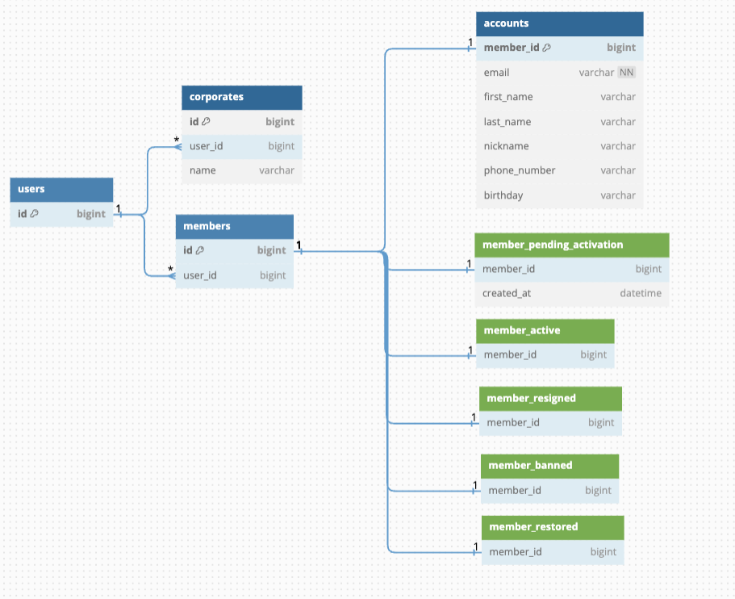
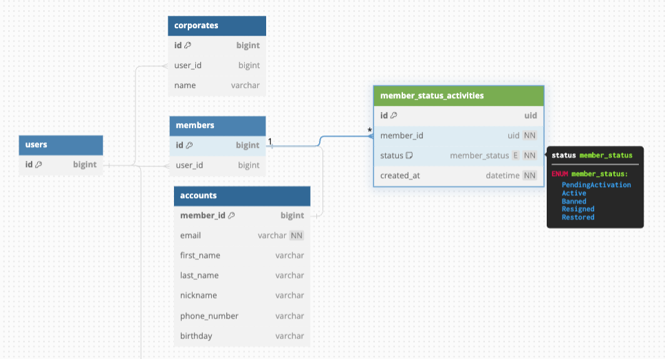
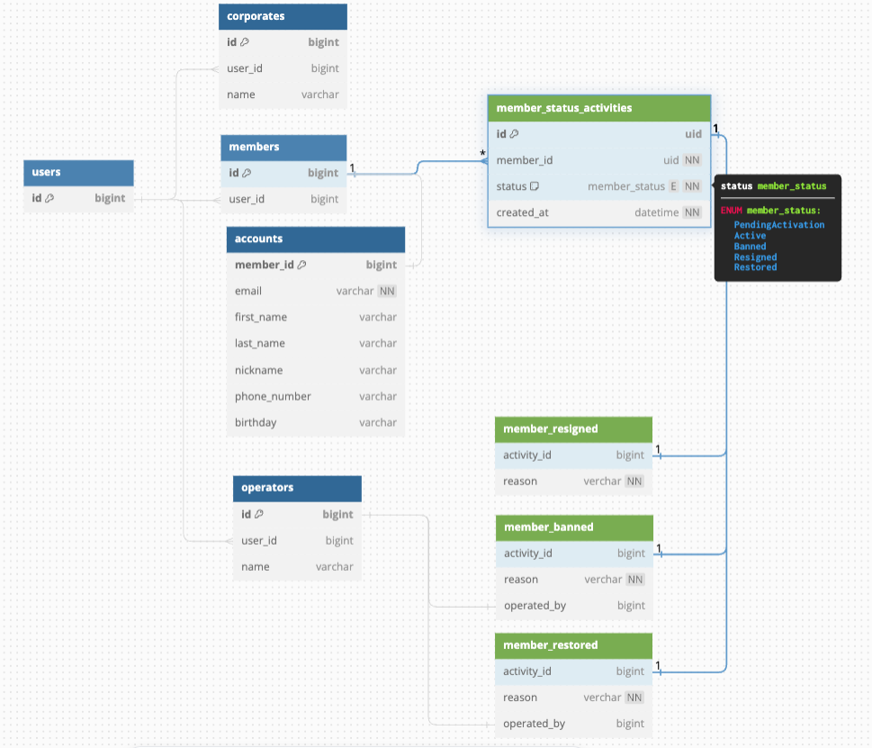
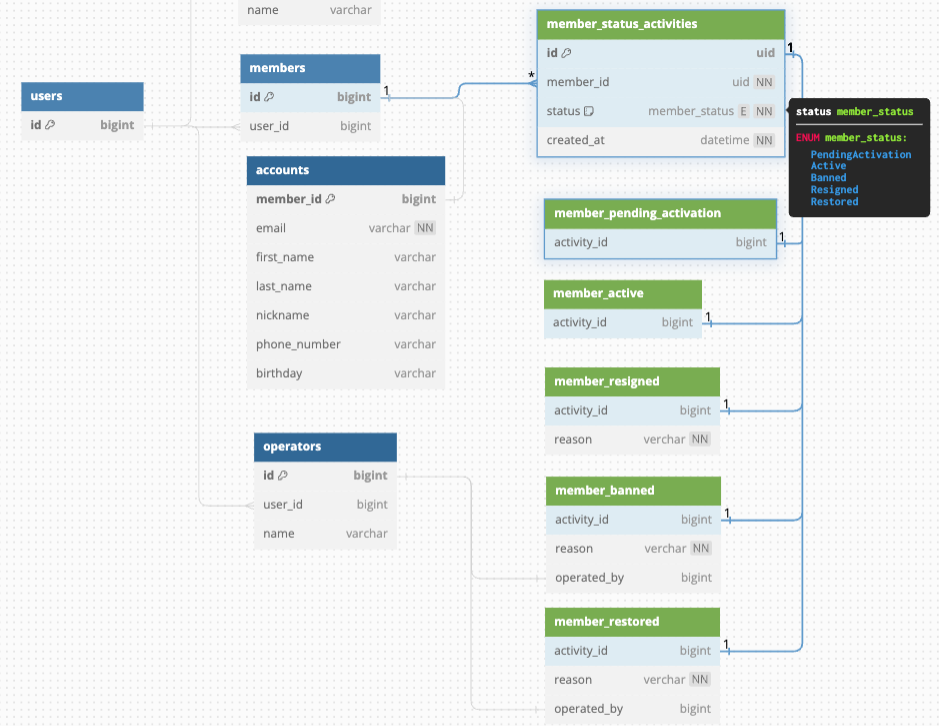
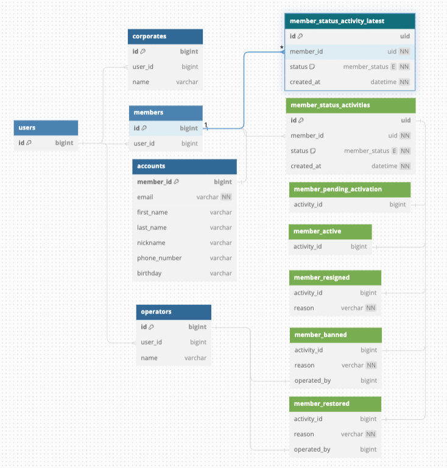
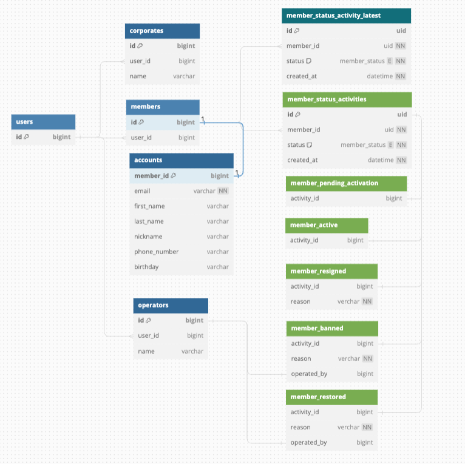
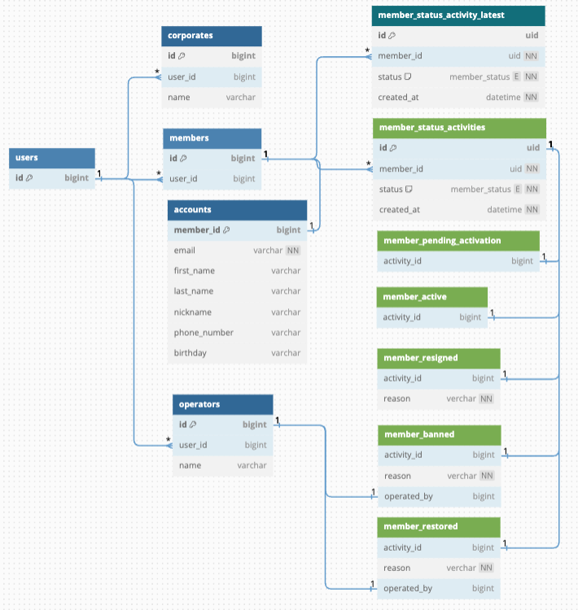

<!-- タイトル: 10秒以内 -->
<!-- タイトル通り、RDBのテーブル設計につけがちなstatusカラムについて説明します -->
# statusカラムから生じる技術的負債とその解決策

---
<!-- 自己紹介: 10秒以内 -->
<!-- 先に自己紹介しますね。r-sugiと言います -->
<!-- エンジニア5年目でフロントエンド歴の方が多めです。-->
# 自己紹介

### フリーランスエンジニア5年目

---
# 今回のアジェンダ
<!-- 今までの業務でstatusカラムに振り回された経験をもとに語りたいです -->
<!-- #　記事の一部抜粋: 10秒以内 -->
- statusカラムがあるとなぜ困るか
- 解決案を1つ提示するので、みんなであれこれ議論したい

---
# statusカラムがあるとなぜ困るか(1/3)
<!-- そもそも何で困るんだっけ？ -->
<!-- 例: ログイン完了時はnull, マイページで値を入れる任意項目 -->
<!-- #　記事の一部抜粋: 15秒以内 -->
- statusカラム
  → 特定のstatusに依存するカラムが増える(nullカラム)
  → カラム多すぎテーブルが生まれる
- statusカラム → 更新したら履歴が消える

---
# statusカラムがあるとなぜ困るか(2/3)
<!-- 放っておくと、開発するのがキツくなる。 -->
<!-- #　記事の一部抜粋: 15秒以内 -->
## データベースの歪み → アプリケーションの歪み
- statusカラム → スパゲティ🍝
- statusカラム x activerecordパターン → 特盛スパゲティ🍝🍝🍝

**→アプリケーション側に、ステータスを考慮した(Null)カラム操作、処理が増え続ける**
**→テーブルは簡単に修正できない**

---
<!-- 特にスタートアップ企業がRubyOnRailsやLaravelを採用して、activerecordパターンで開発を進めるとこうなりがち。 -->
<!-- スパゲティコードの影響でスパゲティコードを書く可能性が上がる。 -->
<!-- #　記事の一部抜粋: 20秒以内 -->
# statusカラムがあるとなぜ困るか(3/3)
## statusカラム x activerecordパターン
→ 特盛スパゲティ🍝🍝🍝 の気配

---
<!-- 前提として、記事を投稿済です。 -->
<!-- こういう場合はどうなの？こうやったらどうかな？というポジティブなコメントだと嬉しいです。 -->
<!-- # 記事のサマリー: 15秒以内 -->
# 投稿済の記事

---
<!-- 先ほどのusersテーブルを例に試しに改善案を説明します。 -->
<!-- # 記事のサマリー: 15秒以内 -->
## 改善過程(1/8): 改善対象usersテーブル

---
<!--まだstatusが存在する -->
<!-- # 記事のサマリー: 15秒以内 -->
## 改善過程(2/8): 意味のある単位に分割・関連づけた

---
<!--まだstatusを切り出せたが、バラバラなので辛い -->
<!-- # 記事のサマリー: 15秒以内 -->
## 改善過程(3/8): statusを切り出した

---
<!--まだstatusをまとめた。いい感じか？やりすぎか？ -->
<!-- # 記事のサマリー: 15秒以内 -->
## 改善過程(4/8): statusで集約させた

---
<!-- こういう要件が追加されると思う -->
<!-- # 記事のサマリー: 30秒以内 -->
## 改善過程(5/8)
### status変更に関する値を保存する
status変更理由、変更操作者などの情報はカラム追加(or 子テーブル追加)
- 例: 退会フォームの入力値、管理者による強制退会の退会理由
- 例: アカウント作成過程で使うワンタイムな値

---
<!-- テーブル構成図にしたとき、全ライフサイクルがテーブルで見えた方が良くないか？ -->
<!-- # 記事のサマリー: 20秒以内 -->
## 改善過程(6/8)
### enumのカラムだけじゃなく、状態テーブルが存在する方が理解しやすいかも。
- 図解したときにライフサイクルが目に入る

---
<!-- ログインユーザーを取得したい -->
<!-- # 記事のサマリー: 20秒以内 -->
## 改善過程(7/8)
### ログインユーザーを判定したい
- 最新のstatusだけのレコードを持つviewを用意した

---
<!-- ログインユーザーがマイページで値を保存するケース -->
<!-- # 記事のサマリー: 20秒以内 -->
## 改善過程(8/8)
### status以外の項目を保存したい
- マイページから入力するアカウント項目を保存したい

---
<!-- こういう分け方をロングタームイベントパターンと呼んでいる記事を見つけました。 -->
<!-- 認証から退会までのライフサイクルを考慮して、自分なりにまとめてみました。 -->
<!-- #　記事の一部抜粋: 30秒以内 -->
## 記事のまとめ
### ロングタームイベントパターン
- ステータスだけ分離させる
- Read/Writeで分ける
- ステータス変更に関する履歴を保存する

---
<!-- チュートリアルや教材でよくとりあげられる「記事投稿サイト」についてこのパターンで検証しています。 -->
<!-- #　記事の一部抜粋: 15秒以内 -->
## 記事の一部抜粋
### 例: 記事投稿サイトで試しています
- 発生しそうなユースケースに対応できるか検証中
- いいね、アドバイスいただけると嬉しいです！

---
<!-- 余った時間: チャットでコメント、記事へのコメントいただけたら嬉しいです！ -->
<!-- #　記事の一部抜粋: 10秒以内 -->
# まとめ
## ✅statusカラムと正しく向き合う！
