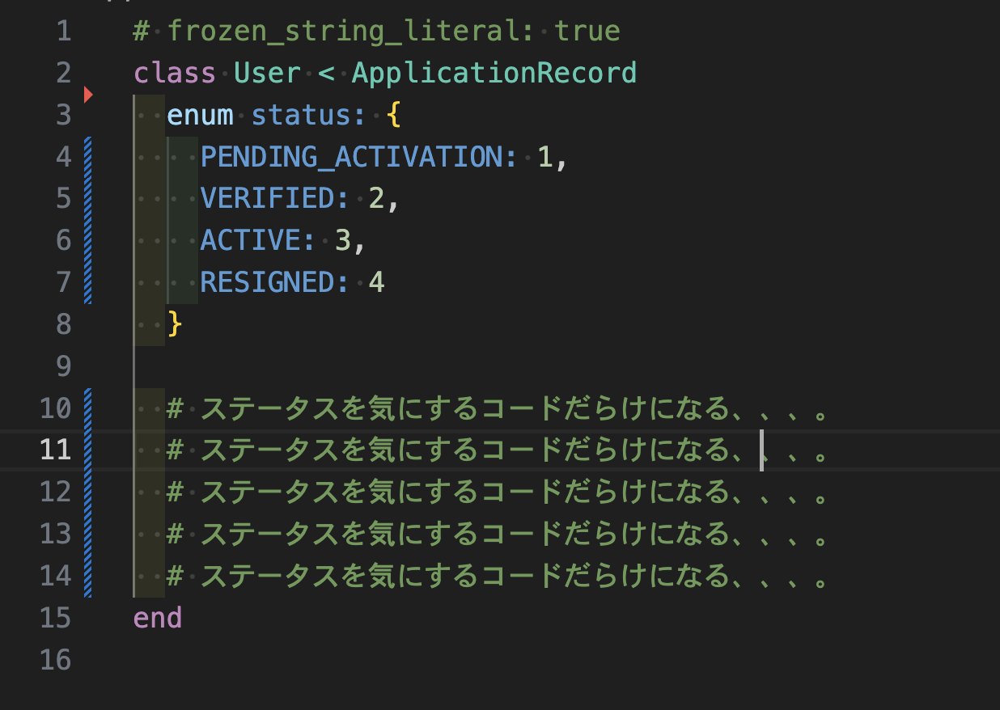

<!-- タイトル: 10秒以内 -->
<!-- 「statusカラムから生じる技術的負債とその解決策」について説明します。 -->
<!-- RDBのテーブル設計で -->
# statusカラムから生じる技術的負債とその解決策

---
<!-- 自己紹介: 15秒以内 -->
<!-- 先に自己紹介しますね。r-sugiと言います -->
<!-- エンジニア5年目でフロントエンド歴の方が多めです。-->
# 自己紹介

### フリーランスエンジニア5年目

---
# 今回のアジェンダ
<!-- #　記事の一部抜粋: 20秒以内 -->
- statusカラムがあるとなぜ困るか
- 解決案を1つ提示するので、みんなであれこれ議論したい

---
# statusカラムがあるとなぜ困るか(1/3)
<!-- #　記事の一部抜粋: 45秒以内 -->
<!-- で、そもそも何で困るんだっけ？ -->
- statusカラム
  → 特定のstatusに依存するカラムが増える(nullカラム)
  → カラム多すぎテーブルが生まれる
- statusカラム → 更新したら履歴が消える

---
# statusカラムがあるとなぜ困るか(2/3)
<!-- #　記事の一部抜粋: 45秒以内 -->
<!-- 放っておくと、開発するのがキツくなる -->
## データベースの歪み → アプリケーションの歪み
- statusカラム → スパゲティ🍝
- statusカラム x activerecordパターン → 特盛スパゲティ🍝🍝🍝

**→アプリケーション側に、ステータスを考慮した(Null)カラム操作、処理が増え続ける**
**→テーブルは簡単に修正できない**

---
# statusカラムがあるとなぜ困るか(3/3)
## statusカラム x activerecordパターンのイメージ
→ 特盛スパゲティ🍝🍝🍝 の気配

---
<!-- # 記事のサマリー: 30秒以内 -->
<!-- 前提として、記事を投稿済です。 -->
<!-- いいね、コメントでアドバイスいただけると助かります。 -->
<!-- こういう場合はどうなの？こうやったらどうかな？というポジティブなコメントだと嬉しいです。 -->
# 投稿済の記事

---
<!-- #　記事の一部抜粋: 30秒以内 -->
## 記事の一部抜粋 How　(1/2)
### ロングタームイベントパターンを使うのはどうだろうか？
ステータスの観点で分離する
Read/Writeで分ける
※記事1つ目,2つ目で説明

---
<!-- #　記事の一部抜粋: 45秒以内 -->
## 記事の一部抜粋 How　(2/2)
### 例: 記事投稿サイトの一部

---
<!-- #　記事の一部抜粋: 10秒以内 -->
# まとめ
## ✅statusカラムと正しく向き合う！
