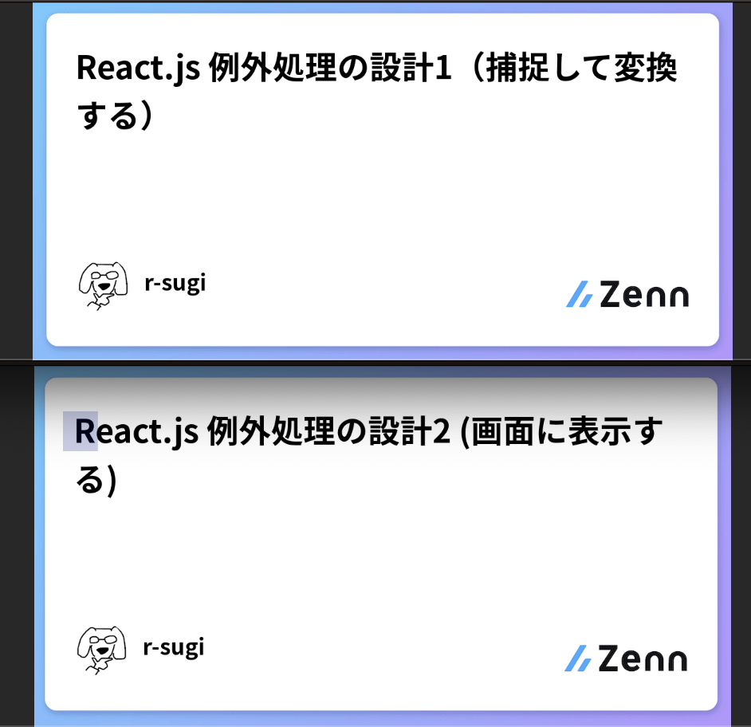
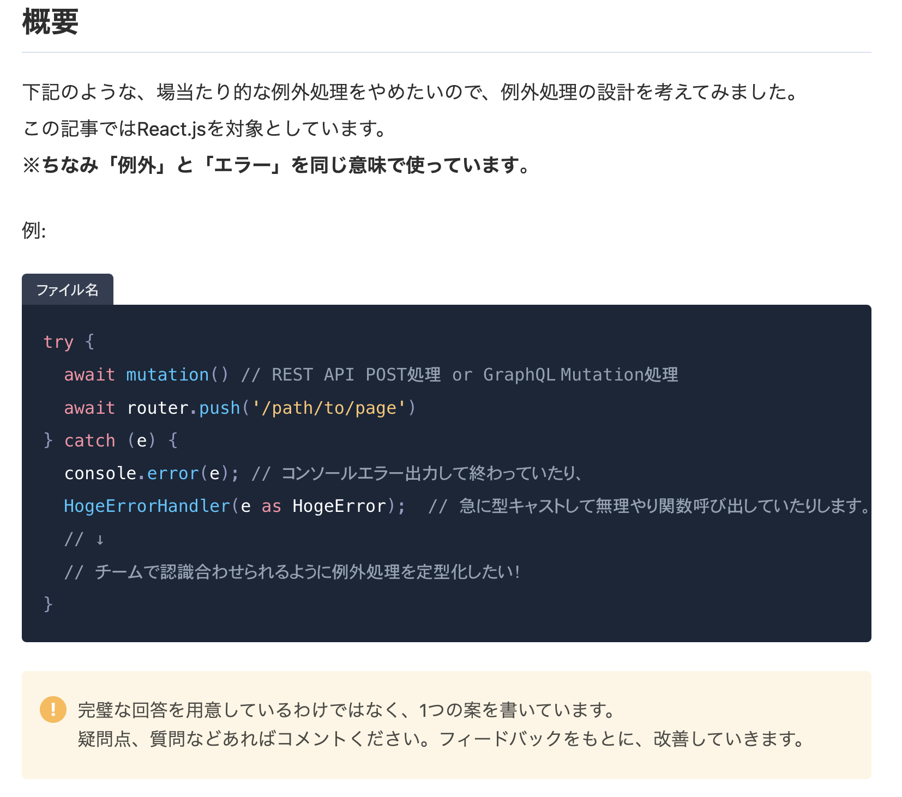
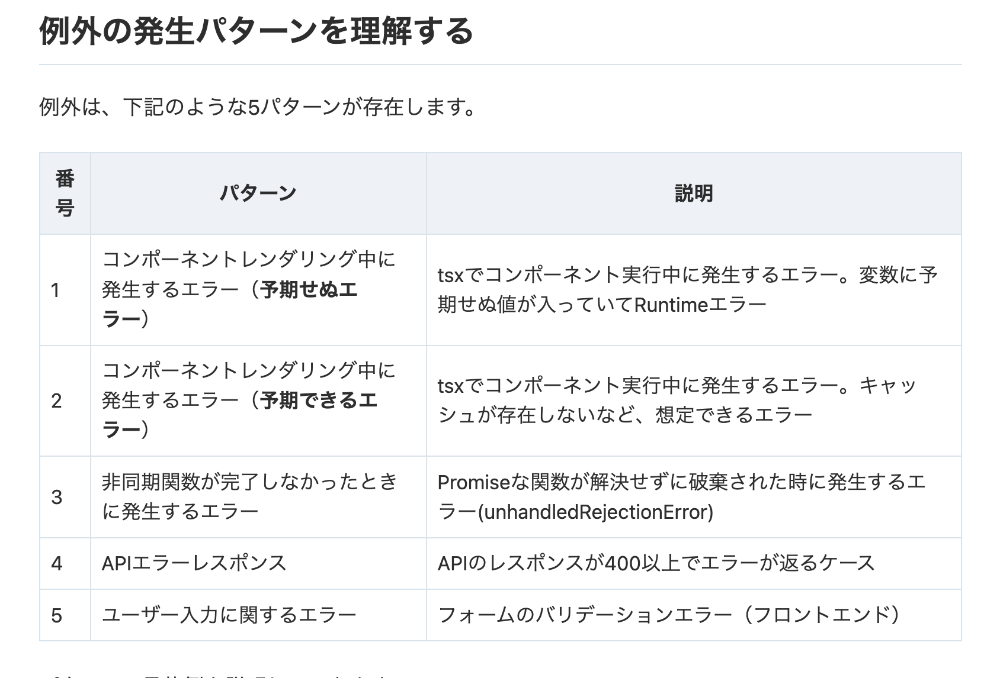
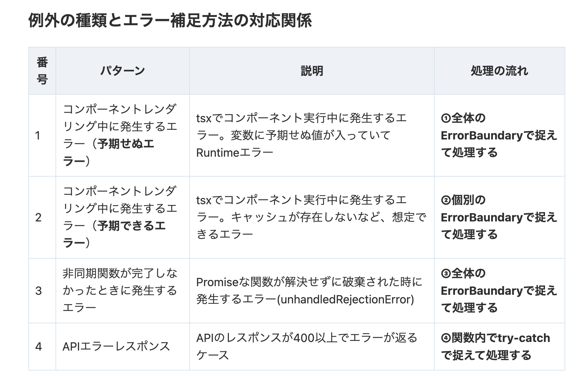
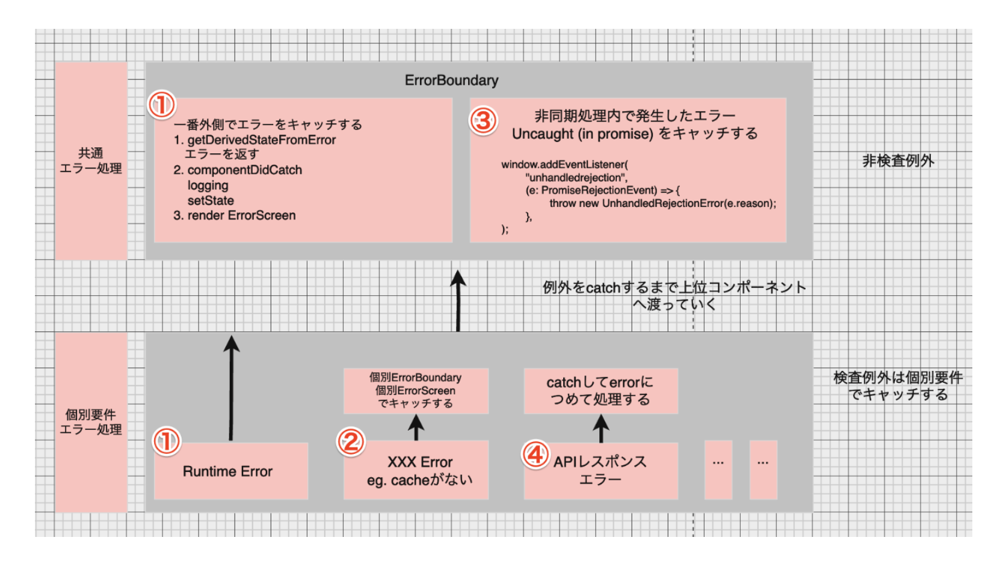
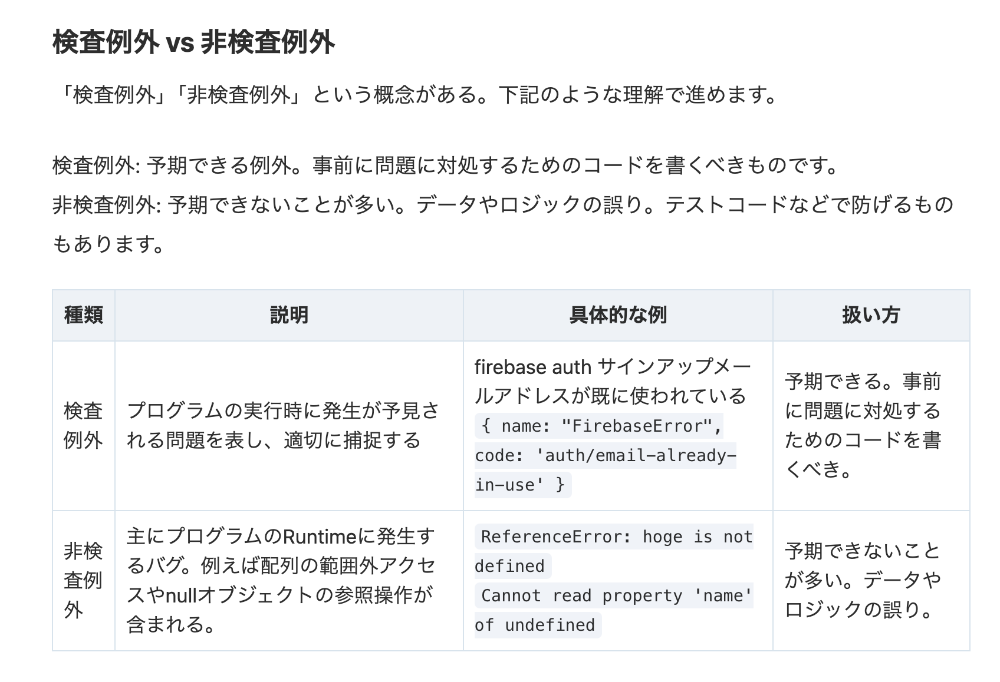
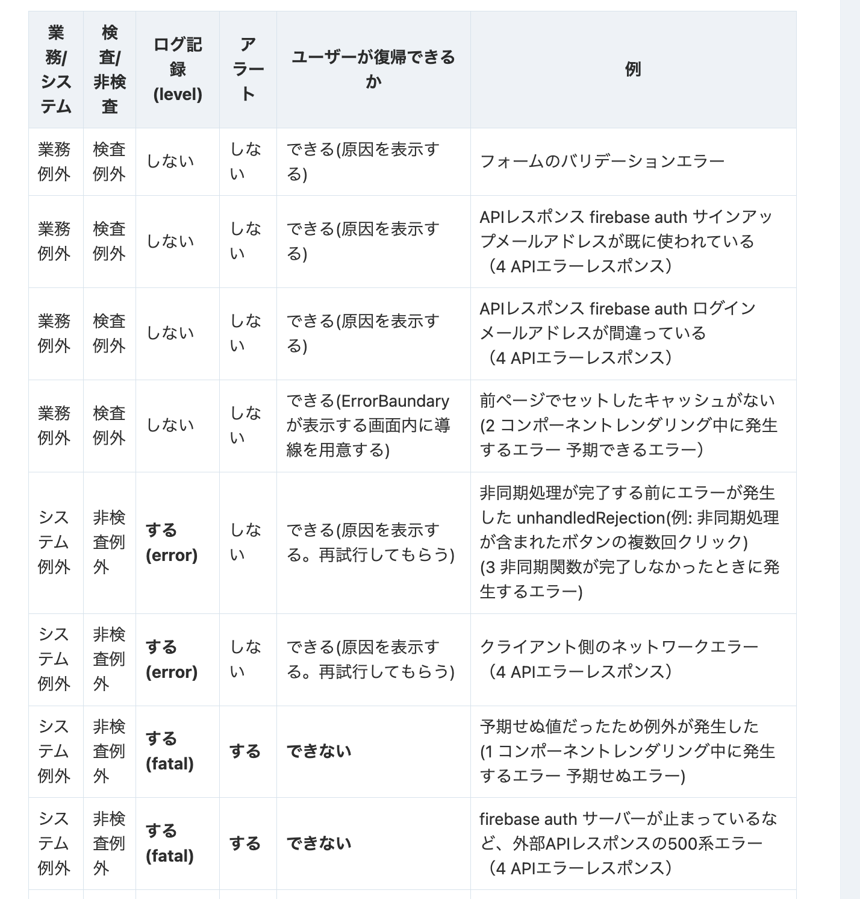
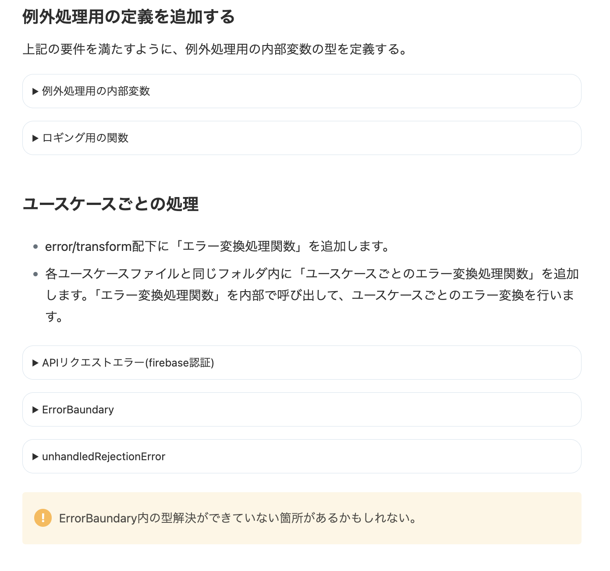

<!-- タイトル: 10秒以内 -->
<!-- タイトル通り、XXXについて説明します -->
<!-- タイトル通り、React.jsとありますが他のJavascriptのFW全般でも同様の考え方で対応できるかもしれません。 -->
# React.js 例外処理の設計

---
<!-- 自己紹介: 10秒以内 -->
<!-- 先に自己紹介します。r-sugiと言います -->
<!-- エンジニア5年目でフロントエンド歴の方が多めです。-->
# 自己紹介

### フリーランスエンジニア5年目

---
# 今回のアジェンダ
<!-- 今までの業務でに振り回された経験をもとに語りたいです -->
<!-- #　記事の一部抜粋: 10秒以内 -->
- フロントエンドの例外処理、どうしてますか？
- 解決案を1つ提示するので、みんなであれこれ議論したい

---
# 例外発生したらどうするんだっけ？
<!-- そもそも -->
<!-- #　記事の一部抜粋: 15秒以内 -->
- 画面に表示する(ユーザーに自力復帰や回避を促す)

- ログ出力(不具合修正時にヒントになる)

- アラートする（クリティカルな問題発生を検知する）

---
<!-- 前提として、記事を投稿済です。 -->
<!-- こういう場合はどうなの？こうやったらどうかな？というポジティブなコメントだと嬉しいです。 -->
<!-- # 記事のサマリー: 15秒以内 -->
# 投稿済の記事

---
<!-- # 記事のサマリー: 15秒以内 -->
## 場当たり的な例外処理

---
<!-- # 記事のサマリー: 15秒以内 -->
## 改善過程(1/4)
## パターンを洗い出す

---
<!-- # 記事のサマリー: 15秒以内 -->

---

## 改善過程(2/4)
## 例外の種類を理解する
<!-- # 記事のサマリー: 15秒以内 -->

---
<!-- # 記事のサマリー: 15秒以内 -->
## 改善過程(3/4)
## 例外の種類ごとに対応方法を決める

---

<!-- # 記事のサマリー: 15秒以内 -->
## 改善過程(4/4)
## プログラムで表現する

---

<!-- #　記事の一部抜粋: 30秒以内 -->
## まとめ
- ✅例外の種類（検査/非検査、業務/システム）を分類する

- ✅例外の種類 x ユースケースに応じて、下記の指定ができる
  - 通知方法を指定し、ユーザーへ通知できる
  - ログレベルを指定し、ログ出力できる
  - アラート要否を指定し、アラートできる
