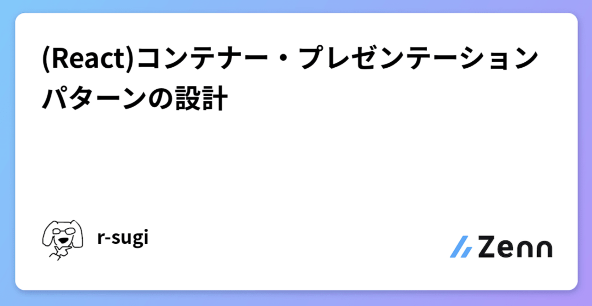
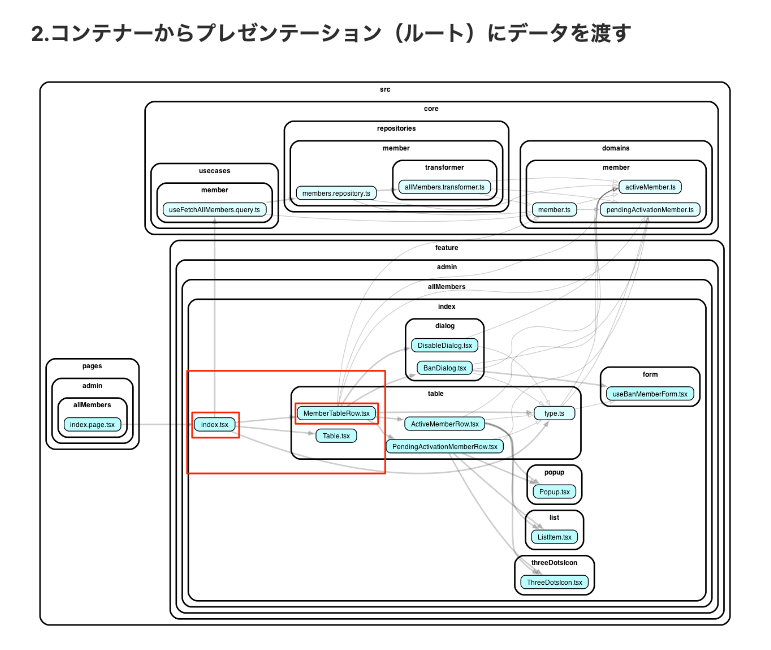
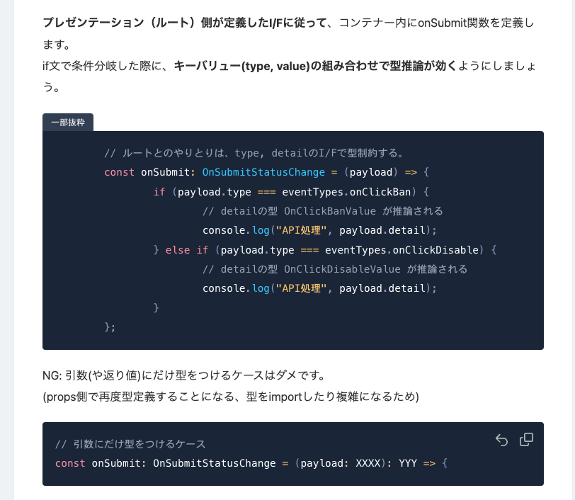
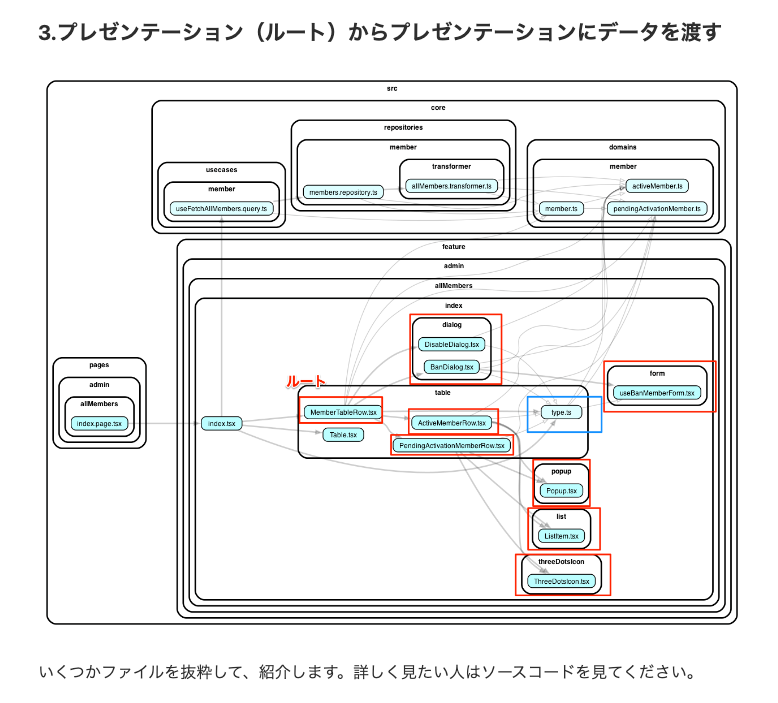
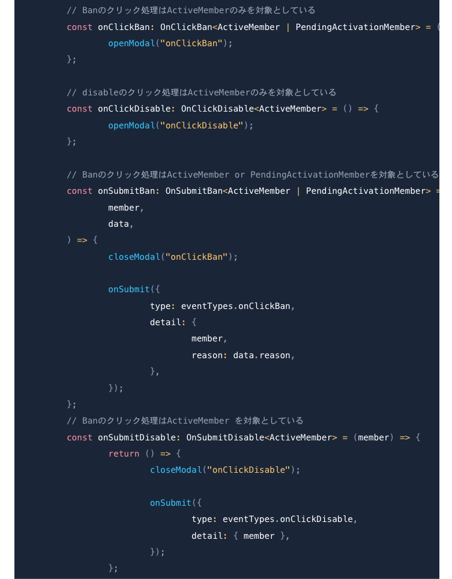
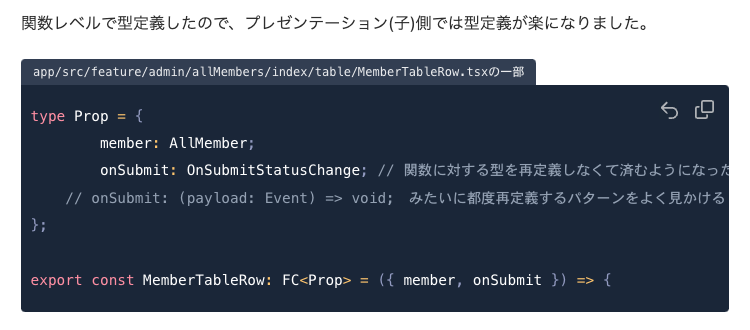
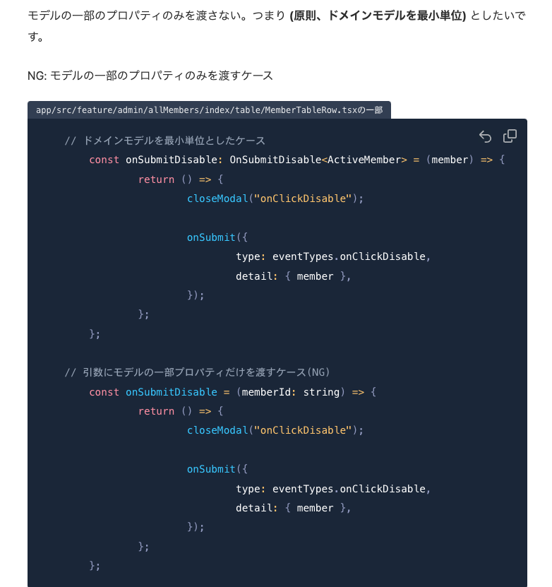

<!-- タイトル: 10秒以内 -->
<!-- タイトル通り、React.jsとありますが他のJavascriptのFW全般でも同様の考え方で対応できるかもしれません。 -->
# (React.js) コンテナープレゼンテーションパターンの設計

---
<!-- 自己紹介: 10秒以内 -->
<!-- 先に自己紹介します。r-sugiと言います -->
<!-- エンジニア5年目でフロントエンド歴の方が多めです。-->
# 自己紹介

### フリーランスエンジニア5年目


---
# 今回のアジェンダ
<!-- 今までの業務でに振り回された経験をもとに語りたいです -->
<!-- #　記事の一部抜粋: 10秒以内 -->
- フロントエンドの複雑さにどう立ち向かっていくか？
- 解決案を1つ提示するので、みんなであれこれ議論したい

---
# フロントエンド設計手法、枯れない問題(1/2)
<!-- #　記事の一部抜粋: 15秒以内 -->
- Class使うか使わないか？
  - (使わないなら)どうやって、データと振る舞いを集約させるか？

- レイヤー分けるか？
  - (分けるなら)その粒度は？

- D/I使うか使わないか？
  - (使わないなら)テストするとき、困らない？

---
# フロントエンド設計手法、枯れない問題(2/2)
<!-- バックエンドにロジックがあるから、フロントエンドはJSON色付け係。フロントエンド側にモデルを作りたくない。 -->
<!-- #　記事の一部抜粋: 15秒以内 -->
- 移り変わりが激しい
  - バックエンドほど設計手法が枯れない

- 治安が良くないから話し合わない(?)
  - 登壇内容を一部切り取って、「これはアンチパターン！」とかXで晒された

- 駆け出しエンジニアが多い
  - バックエンドの設計手法を理解した上で、フロントエンドの設計について話し合う母数が少ない

- 他の職種と比べて単価が低い
  - 優秀な人は単価が高い職種(例: バックエンド, インフラ, DevOps)へ移動(?)

---
<!-- 前提として、記事を投稿済です。 -->
<!-- こういう場合はどうなの？こうやったらどうかな？というポジティブなコメントだと嬉しいです。 -->
<!-- # 記事のサマリー: 15秒以内 -->
# 投稿済の記事


---
<!-- # 記事のサマリー: 15秒以内 -->
## NG: hooksに切り出すだけ
```DogImages.js
import React from "react";
import useDogImages from "./useDogImages";

export default function DogImages() {
  const dogs = useDogImages();

  return dogs.map((dog, i) => );
}
```

---
<!-- # 記事のサマリー: 15秒以内 -->
## ハイライト(1/3)

---
<!-- # 記事のサマリー: 15秒以内 -->



---

## ハイライト(2/3)

---

<!-- # 記事のサマリー: 15秒以内 -->



---

## ハイライト(3/3)

---

<!-- # 記事のサマリー: 15秒以内 -->



---

<!-- #　記事の一部抜粋: 30秒以内 -->
## まとめ
- モデルについて
  - ✅フロントエンドのアプリケーション用のモデルを定義する

- I/Fについて
  - ✅コンテナー・プレゼンテーション間のI/Fを厳密に定義する(EventType)
  - ✅propsで型の再定義をしない（例:callback関数）
  - ✅モデルの一部のプロパティのみを渡さない（例:idだけ渡す）
