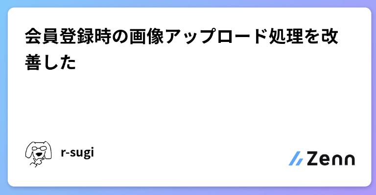
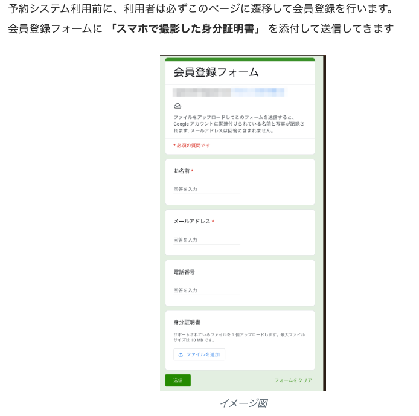
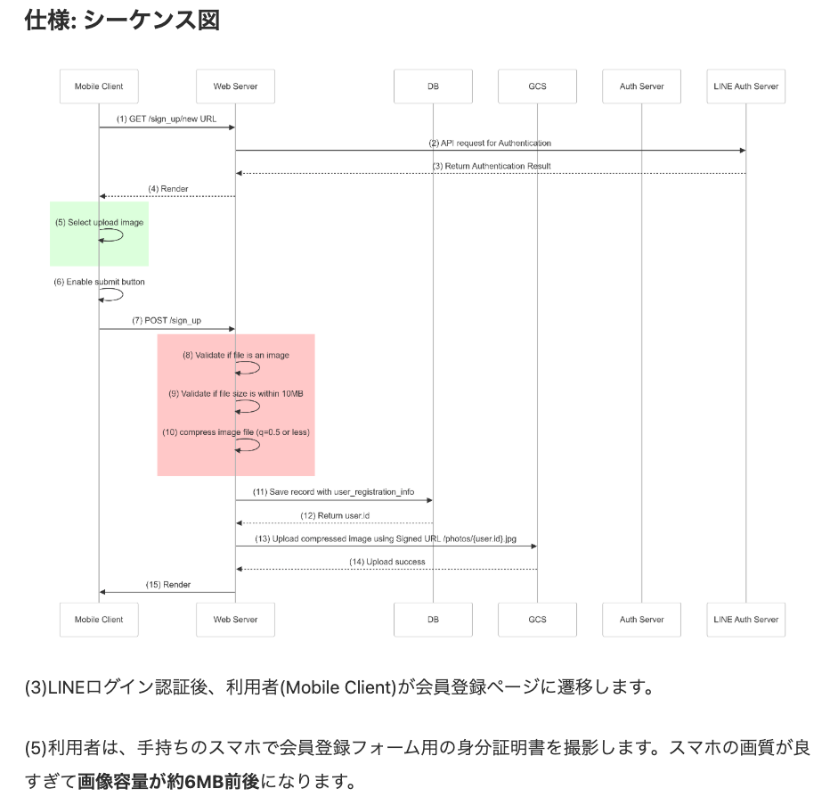
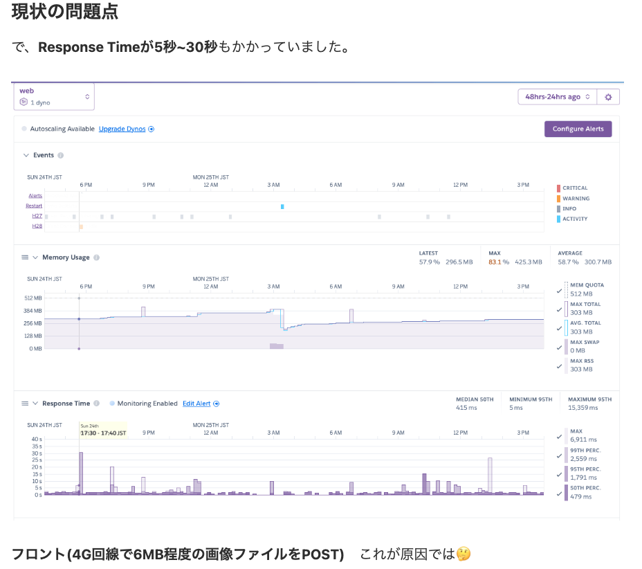
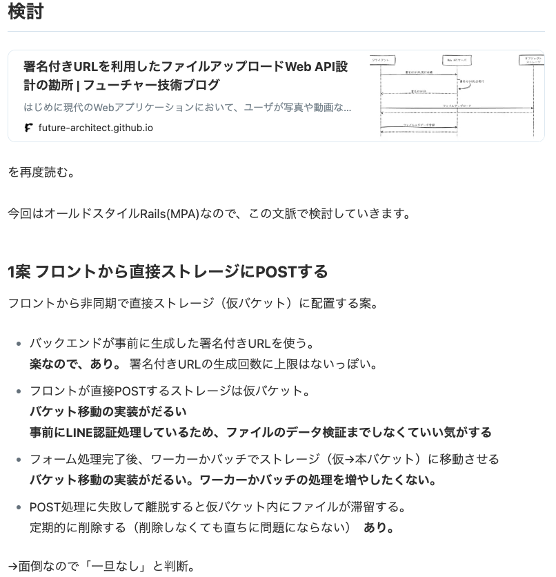
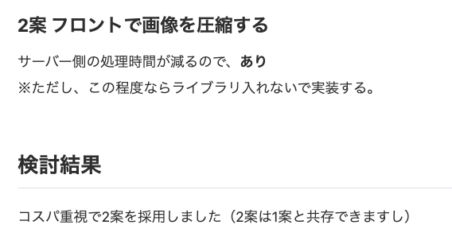
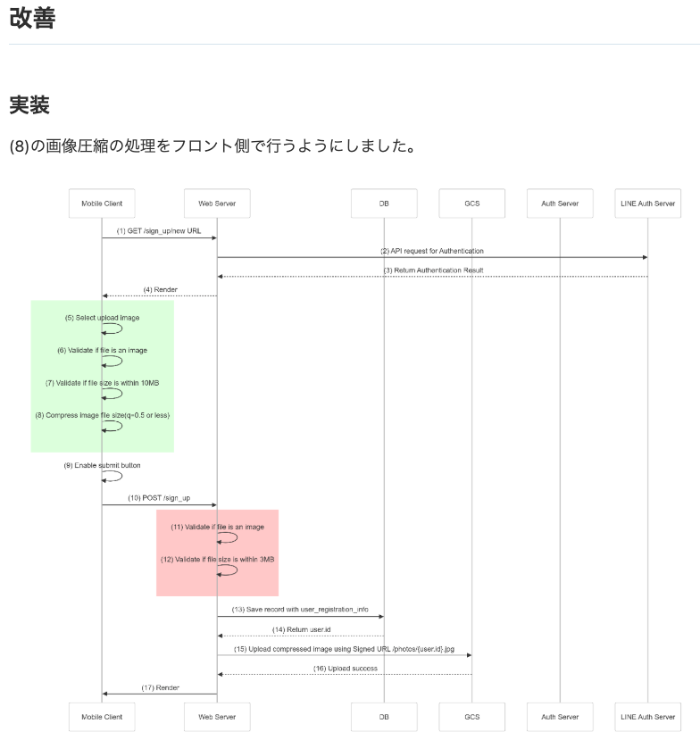
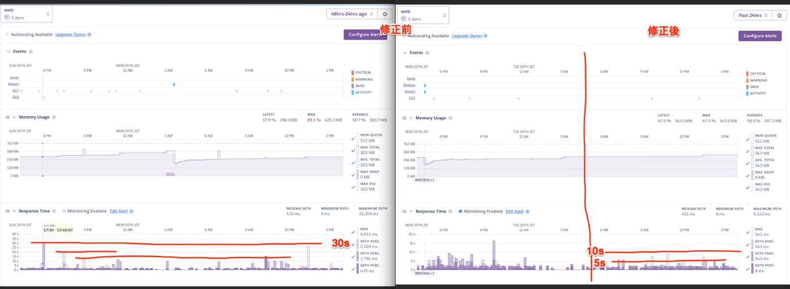

<!-- タイトル: 10秒以内 -->
# 会員登録時の画像アップロード処理を改善した

---
<!-- 自己紹介: 10秒以内 -->
<!-- 先に自己紹介します。r-sugiと言います -->
# 自己紹介

### フリーランスエンジニア5年目

---
# 今回のアジェンダ
<!-- #　記事の一部抜粋: 10秒以内 -->
- システムデザインの例をもっと知りたい
- 試しに1つ提示するので、みんなであれこれ議論したい

---
# システムデザインの例
<!-- #　記事の一部抜粋: 15秒以内 -->
## https://www.techinterviewhandbook.org/

---
<!-- 前提として、記事を投稿済です。 -->
<!-- # 記事のサマリー: 15秒以内 -->
# 投稿済の記事

---
<!-- # 記事のサマリー: 15秒以内 -->
## 会員登録フォーム

---
<!-- # 記事のサマリー: 15秒以内 -->
## シーケンス図
- LINE認証する
- フォームでPOSTする
- バックエンドで画像圧縮処理

---
<!-- # 記事のサマリー: 15秒以内 -->
## メトリクス

---
<!-- # 記事のサマリー: 15秒以内 -->
## 改善案1

---
<!-- # 記事のサマリー: 15秒以内 -->
## 改善案2

---
<!-- # 記事のサマリー: 15秒以内 -->
## 実装
- フロントで画像圧縮させた

---
<!-- # 記事のサマリー: 15秒以内 -->
## 結果
- 平均10秒以下に収まったように見える🚀
- 最終的にResponseTimeが3秒以内になると期待していた。
- が、5秒程度という結果になった。
- どこがボトルネックになっているか詳細は改めて調査が必要（というか検討時点で計測しておくべき）

---

<!-- #　記事の一部抜粋: 30秒以内 -->
## まとめ
（頻出する）API設計のベストプラクティスをまずは頭に入れて、個々の実装で臨機応変に対応していきたい

