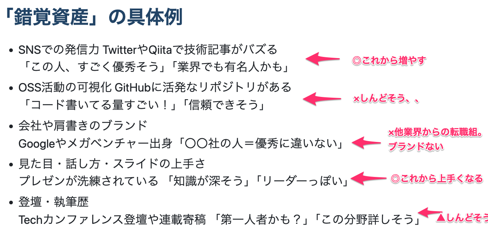
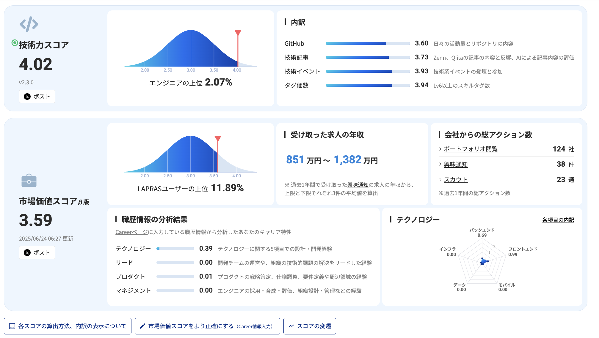
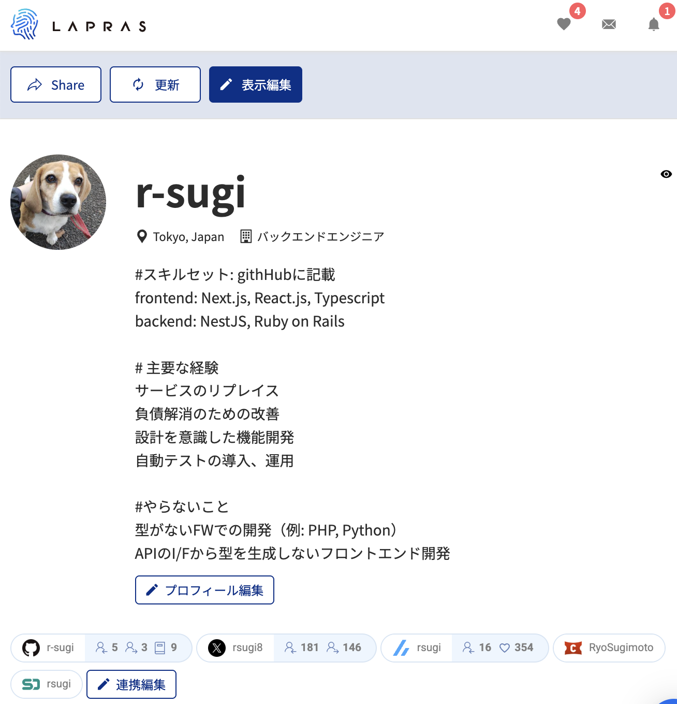
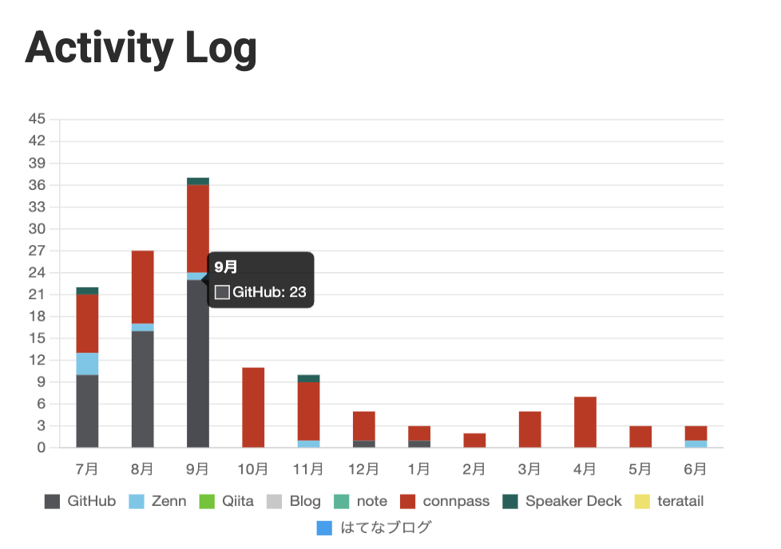
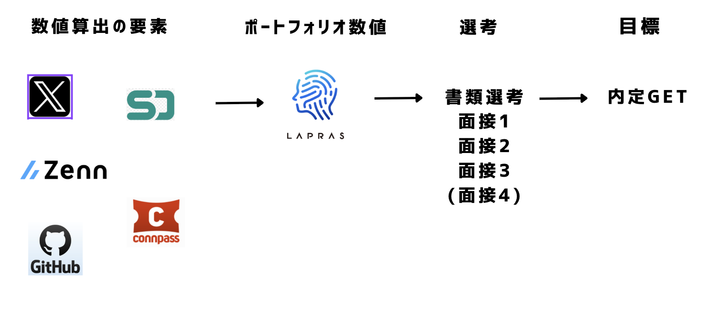
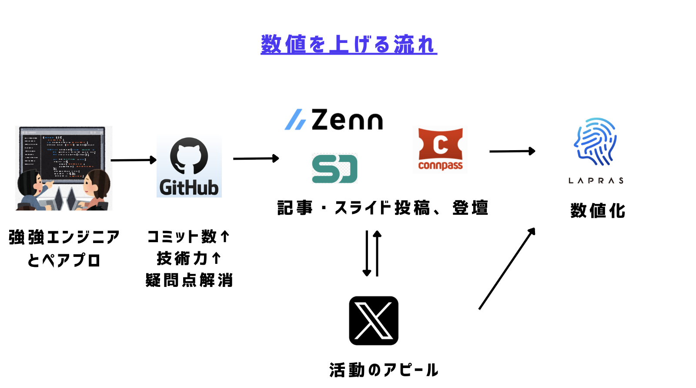
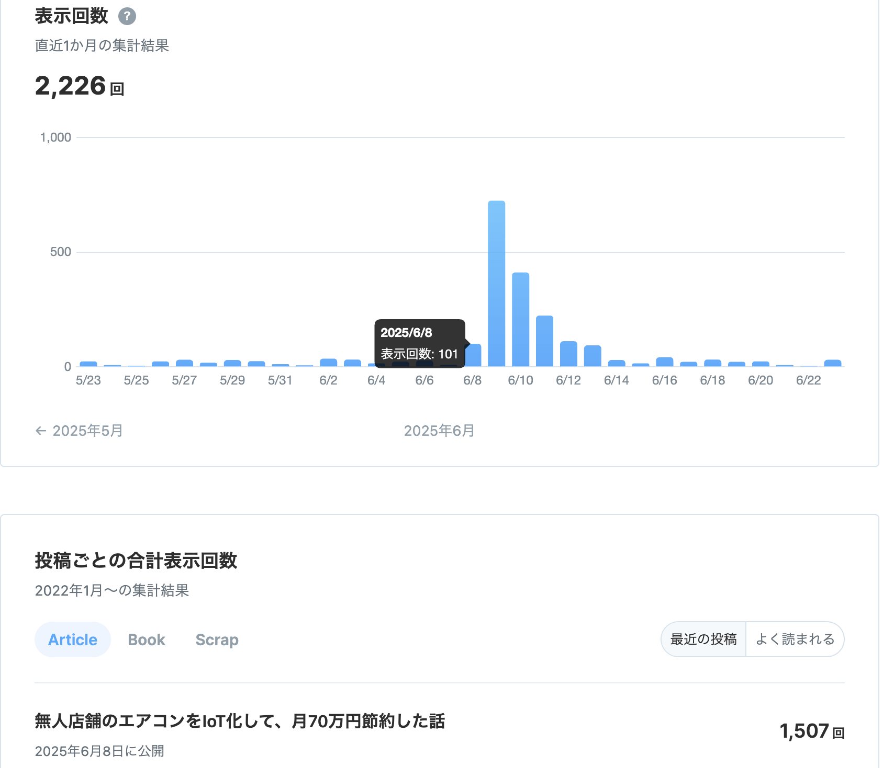

<!-- タイトル: 10秒以内 -->
# 転職活動のための錯覚資産の作り方を完全に理解した

---
# 今回のアジェンダ
<!-- #　記事の一部抜粋: 10秒以内 -->
- 20代後半に他業界から転職してウェブ系エンジニアになった
- 現在7年目のエンジニアが
- 見栄えのするポートフォリオ(錯覚資産)の作り方を理解して、
- 年収800万円の内定をGETした話
をします

---
<!-- 自己紹介: 10秒以内 -->
# 自己紹介

### フリーランスエンジニア7年目
- 正社員1年
- フリーランス6年
- 35歳(2025年)

---
<!-- #　将来への不安、相場感の把握のために行動した -->
# なんで転職活動した？
- エンジニア35歳限界説、大丈夫か？
- 何かあったとき正社員になれそうか？
- 給与どれくらいか？

---
<!-- #  -->
# 「錯覚資産」ってなに？
-  「実力以上にすごそうに見えることで得をする力」
＝ 他人からの“錯覚”によって形成される“信用やブランド価値”

- ITエンジニアの場合、「錯覚資産」は技術力や実績がどれほどあるかとは別に、“すごそうに見える”こと

---
<!-- # -->
# 「錯覚資産」の具体例
- SNSでの発信力	TwitterやQiitaで技術記事がバズる
「この人、すごく優秀そう」「業界でも有名人かも」
- OSS活動の可視化	GitHubに活発なリポジトリがある
「コード書いてる量すごい！」「信頼できそう」
- 会社や肩書きのブランド
Googleやメガベンチャー出身「〇〇社の人＝優秀に違いない」
- 見た目・話し方・スライドの上手さ
プレゼンが洗練されている	「知識が深そう」「リーダーっぽい」
- 登壇・執筆歴
Techカンファレンス登壇や連載寄稿	「第一人者かも？」「この分野詳しそう」

---
<!-- # 「錯覚資産」の具体例 ツッコミあり -->

---

<!-- # 記事のサマリー: 15秒以内 -->
## LAPRASというサービスを利用することにした
- 連携したSNSサービスを数値化
- 右が2025年6月現在のスコア
- 技術力スコア、市場価値スコアが上位
- 公開プロフィール: https://lapras.com/public/2T6JFI5

---

<!-- # 記事のサマリー: 15秒以内 -->
## 連携したSNS
- GitHub: パブリックなコミット数
- X: 主にフォロワー数
- Zenn: フォロー数、いいね数
- Connpass: イベント参加数、LT登壇数
- Speaker Deck: スライド数
※他にも「Qiita, Note, AtCoder」などもあり

---
<!-- # 記事のサマリー: 15秒以内 -->

---

<!-- # 記事のサマリー: 15秒以内 -->

---

<!-- # 記事のサマリー: 15秒以内 -->
## 効率よく数値を稼ぐ！(1/5)
- 日々の業務で発生した疑問点をペアプロで納得いくまでQ&A
- Q&A用のリポジトリを作る

---

<!-- # 記事のサマリー: 15秒以内 -->
## 効率よく数値を稼ぐ！(2/5)
「いいね」をもらう活動
- エンジニアの知り合い全員に「全力で記事書きました！いいねをもらえたら嬉しいです！」と送りまくる
- Zennの記事にポジティブなコメントすると、著者が「いいね！」してくれる
- 同じ技術書を読んだ系の記事に対して、「自分も読んでこんな記事を書きました、もしよかったら！」とコメントすると「いいね！」とView数が増えやすい

---

<!-- # 記事のサマリー: 15秒以内 -->
## 効率よく数値を稼ぐ！(3/5)
ロングテールで見られるトピックにする
- 5年後も読まれそうな抽象度の高いトピックを記事にする
例1: 設計全般、DB設計、例外処理、ビジネス系、キャリア系、カネ系
例2: 事例の紹介
→正社員エンジニアは「業務時間使って」「会社名義」で「実務レベル」の記事を書けるので有利

---

<!-- # 記事のサマリー: 15秒以内 -->
## 効率よく数値を稼ぐ！(4/5)
Zennでバズらせる→いいね稼ぐ
- Xでバズる(or 有名アカウントにリツイートされる) と、Zennでバズる
- 特定の時間帯で100回表示されるとトレンド入りしやすい
- Zennのトップページに表示されると、View数が2000 + 150いいねぐらい

---

<!-- # 記事のサマリー: 15秒以内 -->
## 効率よく数値を稼ぐ！(5/5)
connpassイベントに参加しまくる
- オンライン x 無料 x 参加者が無制限のイベント
- 週に2~4回 -> 月に15回程度参加する

逆に、短期間でのコスパが悪いものはやめる。
- OSSやらない: 難易度高い割に、そこまで評価されない
- AtCoderやらない: 特定の業界以外では、そこまで評価されない
- 個人開発作らない: 中途採用では、ほとんど評価されない
※他にも連携できるSNSサービスがあったが、（上述の）「数値を上げる流れ」に組み込めないのでやらなかった

---

<!-- # 記事のサマリー: 15秒以内 -->
## 成果
- 2025年7月に内定GETした(目標の年収800万円達成)
- 自力での錯覚資産の作り方を理解した(あくまで1例)
- SNSでの発信力が上がった
Xで技術記事がバズった(1回)、Zennで記事がバズった(3回)
- 見た目・話し方・スライドの上手さが向上した
技術記事の書くのに慣れた、LT登壇経験を積めた
- 業務での不明点がクリアーになり、体系的に理解できた
DB設計や例外処理は、業務だと深く議論できないことが多い
