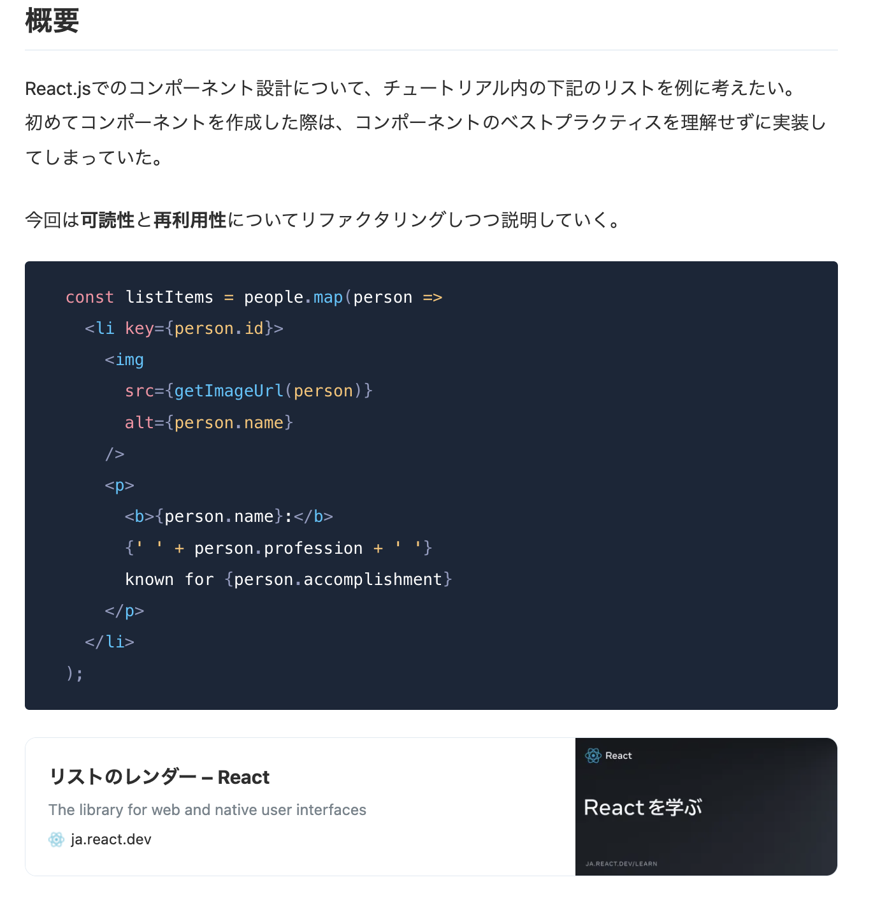
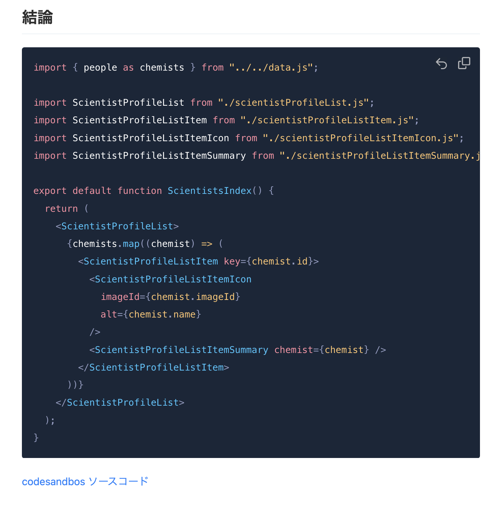

<!-- タイトル: 10秒以内 -->
# コンポーネント設計の学び方をわかりやすく説明する

---
<!-- 自己紹介: 15秒以内 -->
# 自己紹介

フリーランスエンジニア5年目
Github: r-sugi (経歴記載済み)
Zenn: rsugi

---
# 投稿済の記事
<!-- # 記事のサマリー: 30秒以内 -->
- what
  コンポーネント設計で悩んだらどうするか？
- how
  有名ライブラリを真似しよう！

---
## 記事の一部抜粋
<!-- #　記事の一部抜粋: 15秒以内 -->

---
# 今回のアジェンダ
<!-- #　記事の一部抜粋: 20秒以内 -->
- what
  コンポーネント設計で悩んだらどうするか？
- how
  有名ライブラリを真似しよう！
- **Why**
  **なぜこのアプローチをとるのか？**
  **3パターン紹介します**

---
# なぜこのアプローチをとるのか？(1/3)
<!-- #　記事の一部抜粋: 45秒以内 -->
## AがBだから
<!-- TODO: 図解をおく -->
<!-- メンバーのスキル感、 -->

---
# なぜこのアプローチをとるのか？(2/3)
<!-- #　記事の一部抜粋: 45秒以内 -->
## AがBだから
<!-- TODO: 図解をおく -->

---
# なぜこのアプローチをとるのか？(3/3)
<!-- #　記事の一部抜粋: 45秒以内 -->
## AがBだから
<!-- TODO: 図解をおく -->

---
# 終わり
